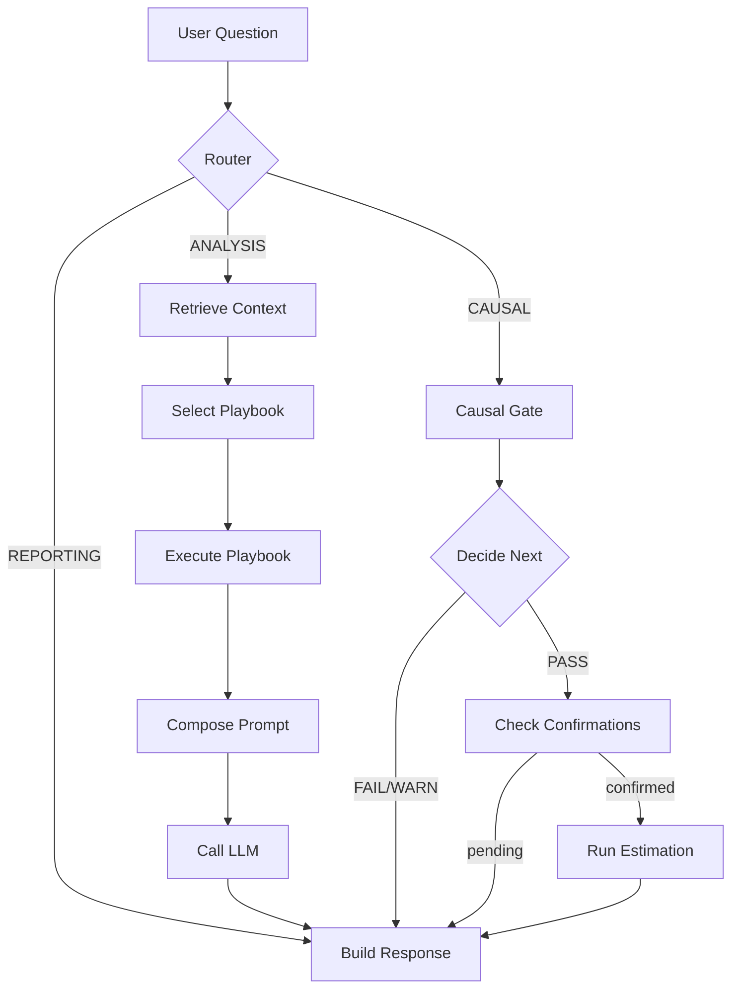

# 🧪 AI Data Scientist Agent

[](https://github.com/Axionis47/ai-data-scientist-agent/actions/workflows/ci.yml)
[](https://www.python.org/downloads/)
[](https://langchain-ai.github.io/langgraph/)
[](https://cloud.google.com/vertex-ai)

An intelligent, guardrailed AI agent for **exploratory data analysis (EDA)** and **causal inference** — built on a modular, extensible spine that enforces safety before any causal estimate is returned.

---

## 🎯 What This Project Does

| Capability | Description |
|------------|-------------|
| **Document Ingestion** | Upload `.docx` context documents with RAG embedding + retrieval |
| **Dataset Analysis** | Upload `.csv` datasets with automatic profiling and EDA playbooks |
| **Causal Safety Gate** | Runs 6 diagnostic checks before allowing causal estimation |
| **Causal Estimation** | IPW and Regression Adjustment with bootstrap confidence intervals |
| **Shadow Mode** | Compare LLM outputs between models without affecting users |
| **Production Ready** | CI/CD, Docker, Cloud Run deployment with health checks |

---

## 🏗️ Architecture Overview

```
┌─────────────────────────────────────────────────────────────────────────────┐
│                              FastAPI Service                                 │
│  /upload_context_doc  /upload_dataset  /ask  /health  /version              │
└─────────────────────────────────────┬───────────────────────────────────────┘
                                      │
                    ┌─────────────────▼─────────────────┐
                    │         LangGraph Agent           │
                    │   11 Nodes • Conditional Edges    │
                    └─────────────────┬─────────────────┘
                                      │
        ┌─────────────┬───────────────┼───────────────┬─────────────┐
        ▼             ▼               ▼               ▼             ▼
   ┌─────────┐  ┌──────────┐   ┌───────────┐   ┌──────────┐   ┌──────────┐
   │ Router  │  │   RAG    │   │  Causal   │   │   EDA    │   │   LLM    │
   │  Node   │  │Retrieval │   │   Gate    │   │Playbooks │   │  Client  │
   └─────────┘  └──────────┘   └───────────┘   └──────────┘   └──────────┘
        │             │               │               │             │
        │        Embeddings      Diagnostics    Deterministic   Vertex AI
        │        (Vertex AI)     + Estimation      Tools       or Fake
        └─────────────┴───────────────┴───────────────┴─────────────┘
```

### LangGraph Node Flow



---

## 🛡️ Causal Safety Gate

**No causal estimate is ever returned without passing safety checks.**

| Check | What It Validates | Failure Threshold |
|-------|-------------------|-------------------|
| `treatment_type_check` | Binary treatment variable | >10 unique values |
| `time_ordering_check` | Temporal precedence | No parseable time column |
| `missingness_check` | Missing data rate | >20% missing |
| `leakage_check` | Post-treatment variables | Suspicious column names |
| `positivity_check` | Propensity score overlap | >10% extreme scores |
| `balance_check` | Covariate balance (SMD) | SMD > 0.25 |

### Readiness Flow

```
FAIL → Block estimation, return diagnostic report + followup questions
WARN → Require user confirmations before proceeding
PASS → Run estimation with IPW + Regression Adjustment
```

---

## 📁 Project Structure

```
ai-data-scientist-agent/
├── packages/
│   ├── agent/                 # LangGraph orchestration
│   │   ├── graph.py           # 11-node StateGraph
│   │   ├── tools_causal.py    # Causal diagnostics
│   │   ├── tools_causal_estimation.py  # IPW, Regression Adj
│   │   ├── tools_eda.py       # Deterministic EDA tools
│   │   ├── retrieval.py       # RAG embedding + retrieval
│   │   ├── llm_provider.py    # Provider selection + shadow mode
│   │   ├── vertex_clients.py  # Vertex AI Gemini + embeddings
│   │   └── fake_clients.py    # Deterministic fakes for CI
│   └── contracts/             # Pydantic request/response models
├── services/
│   └── api/
│       ├── main.py            # FastAPI endpoints
│       └── tests/             # 53 pytest tests
├── docs/
│   └── ARCHITECTURE.md        # Detailed technical docs
├── .github/workflows/
│   ├── ci.yml                 # Lint + test + Docker build
│   └── deploy_staging.yml     # Cloud Run deployment
├── Dockerfile
└── pyproject.toml
```

---

## 🚀 Quick Start

### Local Development

```bash
# Clone
git clone https://github.com/Axionis47/ai-data-scientist-agent.git
cd ai-data-scientist-agent

# Install dependencies
pip install -r services/api/requirements-dev.txt

# Run locally (uses fake LLM/embeddings - no GCP needed)
APP_ENV=dev uvicorn services.api.main:app --reload

# Run tests
pytest services/api/tests/ -v
```

### Docker

```bash
docker build -t ai-data-scientist-agent .
docker run -p 8080:8080 -e APP_ENV=dev ai-data-scientist-agent
```

---

## 🔌 API Endpoints

| Endpoint | Method | Description |
|----------|--------|-------------|
| `/health` | GET | Health check |
| `/version` | GET | Build info (git SHA, timestamp) |
| `/upload_context_doc` | POST | Upload `.docx` → chunk → embed |
| `/upload_dataset` | POST | Upload `.csv` → profile → cache |
| `/ask` | POST | Ask questions with RAG + causal analysis |
| `/debug/config` | GET | LLM config (dev/test only) |

---

## 🔧 Environment Variables

| Variable | Description | Default |
|----------|-------------|---------|
| `APP_ENV` | Environment: `dev`, `test`, `staging`, `prod` | `dev` |
| `GCP_PROJECT` | GCP project ID (required for Vertex AI) | - |
| `GCP_LOCATION` | GCP region | `us-central1` |
| `VERTEX_LLM_MODEL` | LLM model | `gemini-1.5-flash` |
| `SHADOW_MODE_ENABLED` | Enable shadow LLM comparison | `false` |
| `SHADOW_MODE_SAMPLE_RATE` | Fraction of requests to shadow | `0.0` |

---

## 🧩 Architectural Choices

### Why LangGraph?

LangGraph provides **explicit, debuggable control flow** vs. autonomous agents:

- **Deterministic routing**: Pattern-matching router decides paths, not LLM
- **Conditional edges**: Causal gate can block estimation based on diagnostics
- **State management**: All context flows through typed `AgentState`
- **Testability**: Each node can be unit tested in isolation

### Why File-Based Embeddings (No Vector DB)?

For Phase 1-5, we use a simple file-based approach:

```
storage/contexts/{doc_id}/embeddings.json
```

**Rationale:**
- Context documents are small (<50 chunks typical)
- Cosine similarity over 256-dim vectors is fast in pure numpy
- Zero external dependencies to manage
- Fully deterministic and reproducible in CI

**When to migrate**: If documents exceed ~1000 chunks, migrate to Vertex AI Vector Search or Pinecone.

### Why Fake Clients in CI?

The `FakeLLMClient` and `FakeEmbeddingsClient` ensure:

- **Zero network calls** in CI/tests
- **Deterministic outputs** for reproducible tests
- **Fast execution** (~2s for 53 tests)
- **No GCP credentials** required for development

```python
# Automatic selection based on environment
if is_ci_environment() or APP_ENV in ("dev", "test"):
    return FakeLLMClient()  # Deterministic
else:
    return VertexLLMClient()  # Real Gemini
```

### Why a Causal Safety Gate?

Causal inference is **high-stakes** — wrong estimates lead to bad decisions. The gate enforces:

1. **Structural validity**: Binary treatment, known confounders
2. **Statistical validity**: Positivity, overlap, balance checks
3. **User confirmation**: Explicit sign-off before estimation

This prevents the agent from confidently returning a causal estimate when assumptions are violated.

### Why Shadow Mode?

Shadow mode enables **safe LLM comparison** in production:

- Primary response is never affected
- Secondary model runs in parallel with timeout
- Trace events capture similarity metrics
- Useful for: model upgrades, prompt testing, cost optimization

---

## 🔄 Extending the Spine

The architecture is designed for extension. Here's how to add common features:

### Adding a New Playbook

1. Add pattern to `planner.py`:
   ```python
   PLAYBOOKS["CORRELATION"] = {
       "triggers": ["correlation", "relationship between"],
       "tools": ["correlation_matrix", "scatter_plot"]
   }
   ```

2. Add tool to `tools_eda.py`:
   ```python
   def correlation_matrix(df: pd.DataFrame, columns: list[str]) -> TableArtifact:
       ...
   ```

3. Wire in `graph.py` → `execute_playbook_node`

### Adding a New Causal Estimator

1. Add estimator to `tools_causal_estimation.py`:
   ```python
   def propensity_score_matching(df, treatment, outcome, covariates) -> CausalEstimateArtifact:
       ...
   ```

2. Add to `recommended_estimators` in `tools_causal.py`

3. Extend `run_estimation_node` in `graph.py`

### Adding a New Diagnostic Check

1. Add check function to `tools_causal.py`:
   ```python
   def check_sutva_violation(df, unit_col, treatment) -> DiagnosticArtifact:
       # Check for interference between units
       ...
   ```

2. Call from `run_causal_diagnostics()`

3. Update `CausalReadinessReport` aggregation logic

### Adding a New LLM Provider

1. Implement `LLMClient` protocol in new file:
   ```python
   class AnthropicClient:
       def generate(self, prompt: str) -> str:
           ...
   ```

2. Add selection logic to `llm_provider.py`:
   ```python
   if os.getenv("LLM_PROVIDER") == "anthropic":
       return AnthropicClient()
   ```

### Adding Authentication

1. Add middleware in `main.py`:
   ```python
   @app.middleware("http")
   async def auth_middleware(request: Request, call_next):
       token = request.headers.get("Authorization")
       # Validate with Firebase/Auth0
       ...
   ```

2. Add user context to `AgentState`

### Adding a Vector Database

1. Create new client in `packages/agent/vector_client.py`:
   ```python
   class PineconeClient:
       def upsert(self, doc_id: str, chunks: list[ChunkEmbedding]):
           ...
       def query(self, embedding: list[float], top_k: int):
           ...
   ```

2. Replace file operations in `retrieval.py`

---

## 🧪 Testing Strategy

| Test Type | Location | Purpose |
|-----------|----------|---------|
| Unit tests | `test_*.py` | Individual function behavior |
| Integration tests | `test_ask.py` | Full `/ask` workflow |
| Contract tests | Pydantic validation | Schema correctness |
| Docker tests | CI workflow | Container builds and runs |

### Running Tests

```bash
# All tests
pytest services/api/tests/ -v

# Specific test file
pytest services/api/tests/test_causal_gate.py -v

# With coverage
pytest --cov=packages --cov=services --cov-report=html
```

---

## 🚢 Deployment

### CI/CD Pipeline

```
Push to dev → CI (lint + test + docker) → Merge to staging → Deploy to Cloud Run → Smoke checks
```

### Cloud Run Configuration

- **Region**: us-central1
- **Memory**: 512Mi (increase for large datasets)
- **Scaling**: 0-10 instances (staging), 0-100 (prod)
- **Secrets**: GCP credentials via Secret Manager

### Health Checks

- `/health` — Basic liveness
- `/version` — Build info (git SHA, timestamp)
- Smoke test: `/ask` with simple question

---

## 📊 Trace Events

All operations emit structured trace events for observability:

| Event | When Emitted |
|-------|--------------|
| `LLM_PROVIDER_USED` | Every LLM call |
| `SHADOW_LLM_RESULT` | Shadow mode completion |
| `SHADOW_DIFF` | Shadow vs primary comparison |
| `DIAGNOSTIC_RUN` | Causal gate check |
| `ESTIMATION_COMPLETE` | Causal estimate returned |

---

## 🗺️ Roadmap

| Phase | Status | Description |
|-------|--------|-------------|
| Phase 0 | ✅ | API spine, contracts, validation |
| Phase 1 | ✅ | LangGraph, RAG, Vertex AI |
| Phase 2 | ✅ | EDA playbooks, dataset upload |
| Phase 3 | ✅ | Causal safety gate |
| Phase 4 | ✅ | Causal estimation (IPW, Regression Adj) |
| Phase 5 | ✅ | Shadow mode, provider tracing |
| Phase 6 | 🔲 | Chat UI |
| Phase 7 | 🔲 | Multi-turn memory |
| Phase 8 | 🔲 | More estimators (matching, DiD, sensitivity) |
| Phase 9 | 🔲 | Report generation (PDF/HTML) |

---

## 📄 License

MIT

---

## 🤝 Contributing

1. Fork the repository
2. Create a feature branch from `dev`
3. Write tests for new functionality
4. Ensure CI passes (ruff + pytest + docker build)
5. Open PR into `dev`

---

Built with ❤️ using LangGraph, FastAPI, and Vertex AI


