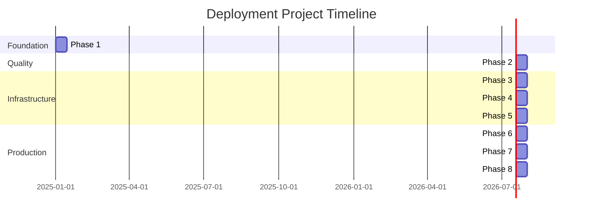

# Phase-Wise Audit & Deployment System Design

## Overview

This document defines the phase-wise system for auditing and deploying the Bot Data Scientist project. Each phase is self-contained with clear inputs, outputs, and handoff documentation.

## Design Principles

1. **Self-Contained Phases**: Each phase can be executed independently
2. **Clear Handoffs**: Structured documentation between phases
3. **Traceable Decisions**: All decisions logged with rationale
4. **Actionable Outputs**: Each phase produces concrete artifacts
5. **Progressive Enhancement**: Each phase builds on previous work

## Phase Structure

Each phase follows this structure:

```
audit-deployment/
├── phase-{N}/
│   ├── 00-PHASE_BRIEF.md          # Phase objectives and scope
│   ├── 01-INPUT_HANDOFF.md        # Input from previous phase
│   ├── 02-EXECUTION_PLAN.md       # Detailed execution plan
│   ├── 03-FINDINGS/               # Audit findings and analysis
│   ├── 04-ARTIFACTS/              # Generated artifacts (configs, scripts)
│   ├── 05-DECISIONS.md            # Key decisions and rationale
│   ├── 06-OUTPUT_HANDOFF.md       # Output for next phase
│   └── 07-VALIDATION.md           # Validation checklist
```

## Phase Definitions

### **Phase 1: Foundation Audit & Baseline** (Weeks 1-2)
**Input**: Current codebase
**Output**: Audit report, baseline metrics, remediation plan
**Handoff**: `phase-1/06-OUTPUT_HANDOFF.md`

**Deliverables**:
- Code quality audit report
- Dependency vulnerability scan
- Test coverage analysis
- Security baseline assessment
- Technical debt inventory
- Prioritized remediation roadmap

### **Phase 2: Testing & Quality Enhancement** (Weeks 3-4)
**Input**: Phase 1 audit findings
**Output**: Enhanced test suite, quality gates
**Handoff**: `phase-2/06-OUTPUT_HANDOFF.md`

**Deliverables**:
- Expanded test coverage (>80%)
- Integration test suite
- Performance test framework
- Enhanced CI/CD pipeline
- Quality metrics dashboard
- Pre-commit hooks

### **Phase 3: Containerization & Packaging** (Weeks 5-6)
**Input**: Phase 2 quality gates
**Output**: Container images, local deployment
**Handoff**: `phase-3/06-OUTPUT_HANDOFF.md`

**Deliverables**:
- Dockerfile and multi-stage builds
- Docker Compose setup
- Container registry integration
- Image scanning pipeline
- Local deployment guide
- Container health checks

### **Phase 4: Infrastructure as Code** (Weeks 7-8)
**Input**: Phase 3 container artifacts
**Output**: IaC templates, environment configs
**Handoff**: `phase-4/06-OUTPUT_HANDOFF.md`

**Deliverables**:
- Terraform/CloudFormation modules
- Environment configurations (dev/staging/prod)
- Network architecture
- Secrets management setup
- IAM policies and roles
- Infrastructure documentation

### **Phase 5: Deployment Pipeline** (Weeks 9-10)
**Input**: Phase 4 infrastructure
**Output**: Automated deployment workflows
**Handoff**: `phase-5/06-OUTPUT_HANDOFF.md`

**Deliverables**:
- GitHub Actions deployment workflows
- Environment promotion strategy
- Blue-green deployment setup
- Rollback procedures
- Deployment runbooks
- Smoke test suite

### **Phase 6: Monitoring & Observability** (Weeks 11-12)
**Input**: Phase 5 deployed environments
**Output**: Monitoring stack, dashboards
**Handoff**: `phase-6/06-OUTPUT_HANDOFF.md`

**Deliverables**:
- Centralized logging setup
- Metrics collection and dashboards
- Alerting rules and notifications
- Distributed tracing
- SLO/SLA definitions
- Incident response playbook

### **Phase 7: Security Hardening** (Weeks 13-14)
**Input**: Phase 6 monitoring baseline
**Output**: Hardened infrastructure, compliance docs
**Handoff**: `phase-7/06-OUTPUT_HANDOFF.md`

**Deliverables**:
- Secrets management implementation
- Security scanning automation
- RBAC and IAM hardening
- Compliance documentation
- Security audit report
- Penetration test results

### **Phase 8: Production Readiness** (Weeks 15-16)
**Input**: Phase 7 security validation
**Output**: Production-ready system
**Handoff**: `phase-8/06-OUTPUT_HANDOFF.md`

**Deliverables**:
- Load testing results
- Disaster recovery plan
- Complete operations manual
- Production deployment guide
- Team training materials
- Go-live checklist

## Handoff Document Template

Each phase's `06-OUTPUT_HANDOFF.md` follows this structure:

```markdown
# Phase {N} → Phase {N+1} Handoff

## Phase {N} Summary
- Objectives achieved
- Key deliverables
- Metrics and KPIs

## Critical Findings
- Issues discovered
- Risks identified
- Blockers resolved

## Decisions Made
- Decision 1: [Description] → Rationale
- Decision 2: [Description] → Rationale

## Artifacts Produced
- Artifact 1: [Location] - [Purpose]
- Artifact 2: [Location] - [Purpose]

## Phase {N+1} Prerequisites
- [ ] Prerequisite 1
- [ ] Prerequisite 2

## Phase {N+1} Inputs
- Input 1: [Location] - [Description]
- Input 2: [Location] - [Description]

## Recommended Next Steps
1. Step 1
2. Step 2

## Open Questions
- Question 1
- Question 2

## Risks & Dependencies
- Risk 1: [Impact] - [Mitigation]
- Dependency 1: [Description]
```

## Validation Gates

Each phase must pass validation before handoff:

1. **Completeness**: All deliverables produced
2. **Quality**: Meets defined quality criteria
3. **Documentation**: All decisions documented
4. **Testing**: Validation tests pass
5. **Review**: Peer review completed
6. **Approval**: Stakeholder sign-off

## Success Metrics

### Phase 1-2 (Foundation & Testing)
- Code coverage: >80%
- Security vulnerabilities: 0 critical, <5 high
- Test execution time: <5 minutes
- Documentation coverage: 100% of public APIs

### Phase 3-5 (Containerization & Deployment)
- Container build time: <5 minutes
- Deployment time: <10 minutes
- Rollback time: <2 minutes
- Infrastructure provisioning: <15 minutes

### Phase 6-8 (Monitoring & Production)
- Alert response time: <5 minutes
- Log retention: 30 days
- Uptime SLA: 99.9%
- Mean time to recovery: <30 minutes

## Tooling & Automation

Each phase uses specific tools:

- **Phase 1**: pytest-cov, bandit, safety, mypy, pylint
- **Phase 2**: pytest, locust, GitHub Actions
- **Phase 3**: Docker, docker-compose, Trivy
- **Phase 4**: Terraform, AWS CLI, Vault
- **Phase 5**: GitHub Actions, ArgoCD, Helm
- **Phase 6**: Prometheus, Grafana, ELK, Jaeger
- **Phase 7**: Snyk, OWASP ZAP, AWS Security Hub
- **Phase 8**: k6, Chaos Monkey, Runbook automation

## Communication Plan

- **Daily**: Slack updates in #deployment-project
- **Weekly**: Phase progress review meeting
- **Phase Completion**: Handoff presentation
- **Blockers**: Immediate escalation to project lead

## Risk Management

Each phase includes:
- Risk register
- Mitigation strategies
- Contingency plans
- Escalation procedures

## Timeline & Dependencies



## Next Steps

1. Review and approve this phase system design
2. Set up phase directory structure
3. Begin Phase 1 execution
4. Schedule weekly review meetings

---

**Document Version**: 1.0
**Last Updated**: 2025-10-17
**Owner**: DevOps Team
**Reviewers**: Engineering Lead, Security Team, Operations Team

