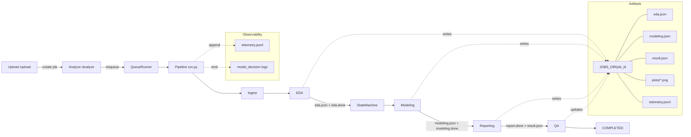

# Backend Architecture

This backend implements an AI Data Scientist agent that ingests a dataset, performs fast EDA, optionally trains a simple ML model with explainability, and generates an HTML report. The system is designed for robustness and observability.

## High-level flow
1. Upload via /upload → creates a job directory under data/jobs/{job_id}/original and returns identifiers
2. Analyze via /analyze → enqueues a background run of the pipeline for that job
3. Pipeline stages → ingest → eda → clarify (if needed) → modeling → report → qa → done
4. Result → /result/{job_id} returns result.json including report_html

## Key modules
- app/main.py: FastAPI app, endpoints, static serving guard, queue wiring
- app/pipeline/run.py: end-to-end pipeline, stage transitions, timeouts, resumability
- app/eda/eda.py: EDA computation, plotting, time-series hints
- app/modeling/pipeline.py: model candidates, CV, basic explainability, modeling.json
- app/reporting/report.py: HTML reporting; JSON-first path (flag) with validation + fallback
- app/platform/jobstore.py: simple job state store used by pipeline and endpoints
- app/platform/statemachine.py: validates stage transitions and records timeline
- app/platform/queue_runner.py: wraps LocalThreadQueue with a concurrency cap
- app/core/config.py: configuration and feature flags
- app/core/schemas.py: lightweight validators for EDA/modeling/report JSON
- app/core/telemetry.py: append per-run telemetry.jsonl for analysis

## Files & directories
- data/jobs/{job_id}
  - original/ … uploaded file
  - manifest.json, manifest.done
  - eda.json, eda.done
  - modeling.json, modeling.done
  - critique.json (optional)
  - result.json
  - report.done (and report.html if saved separately)
  - telemetry.jsonl
  - plots/*.png

## Execution model
- Background execution uses LocalThreadQueue via QueueRunner with MAX_CONCURRENT_JOBS
- Stage timeouts (EDA/MODEL/REPORT) are enforced if configured
- Cancellation: POST /cancel/{job_id} sets a flag; pipeline checks at heavy boundaries
- Resumability: artifacts + .done markers allow deterministic skip on restart
- State machine: transitions recorded in job.timeline with timestamps
- Heartbeat: heartbeat_ts field updated during run

## Configuration (env)
- MAX_UPLOAD_MB, ALLOWED_EXTS, LARGE_FILE_MB
- EDA_TIMEOUT_S, MODEL_TIMEOUT_S, REPORT_TIMEOUT_S, MAX_CONCURRENT_JOBS
- CV_FOLDS, EARLY_STOP_SAMPLE, HGB_MIN_ROWS, SEARCH_TIME_BUDGET, SHAP_* flags
- REPORT_JSON_FIRST (experimental)
- SAFE_AUTO_ACTIONS (experimental)
- STATIC_EXPOSE_ORIGINAL (default: false)
- Brand theming: REPORT_PRIMARY/ACCENT/BG/SURFACE/TEXT/MUTED/OK/WARN/ERROR/FONT_FAMILY/LOGO_URL

## API endpoints (summary)
- POST /upload → create job and store file
- POST /analyze → enqueue job; writes manifest.json; returns job_id
- POST /clarify → update manifest; resume modeling via queue
- GET /status/{job_id} → live status
- GET /result/{job_id} → result.json with report_html
- POST /cancel/{job_id} → request cancellation
- GET /health → simple health check

## Observability
- Logs: concise decisions recorded via app/core/logs
- Telemetry: per-run JSONL with durations_ms, status, timings, selected_tools, features, warnings
- Timings: result.json includes timings.stage_starts; job.durations_ms aggregates stage durations

## Security & safety
- Static guard blocks access to original/ by default
- Upload type enforcement; dataset path validation
- Defensive exception handling with short messages instead of silent failures

## Testing
- pytest suite (~13 tests) covers API flow, clarify gating, EDA basics, modeling logs, router fallback, security

## Extensibility
- Job Store/Queue are abstracted; can be replaced with Firestore/PubSub
- Reporting supports JSON-first generation and deterministic fallback
- Auto-actions (SAFE_AUTO_ACTIONS) allow conservative automated tweaks

## Architecture diagram

